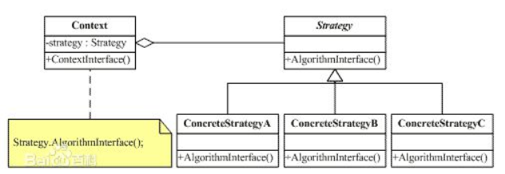

策略模式的定义：
    策略模式定义了一系列的算法，并将每一个算法封装起来，而且使它们还可以相互替换，策略模式让算法独立于使用它的客户而独立变化。

策略模式中有三个对象：
    环境对象(Context)：该类中实现了对抽象策略中定义的接口或者抽象类的引用。
    抽象策略对象(Strategy)：它可由接口或抽象类来实现。
    具体策略对象(ConcreteStrategy)：它封装了实现同不功能的不同算法。
    
策略模式的实现：
　　1.对策略对象定义一个公共接口。
　　2.编写策略类，该类实现了上面的公共接口。
　　3.在使用策略对象的类中保存一个对策略对象的引用。
　　4.在使用策略对象的类中，实现对策略对象的set和get方法或者使用构造方法完成赋值。

策略模式设计结构图:
   

还可参考博客
https://www.cnblogs.com/java2016/p/5386615.html
https://www.cnblogs.com/fingerboy/p/5468994.html