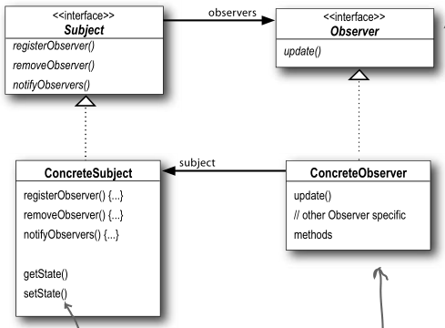

观察者模式的定义:
    定义对象之间的一对多依赖,这样依赖,当一个对象改变状态时,它的所有依赖者都会受到通知并自动更新.
    
要点：
1． 主题用一个共同的接口来通知观察者(notifyObservers)
2． 主题和观察者之间松耦合，主题不知道观察者的细节，只知道观察者实现了观察者接口(update)
3． 推，拉模式各有千秋,推的实现要简单一些

观察者模式有4个对象:
    Subject：抽象主题（抽象被观察者），抽象主题角色把所有观察者对象保存在一个集合里，每个主题都可以有任意数量的观察者，抽象主题提供一个接口，可以增加和删除观察者对象。
    ConcreteSubject：具体主题（具体被观察者），该角色将有关状态存入具体观察者对象，在具体主题的内部状态发生改变时，给所有注册过的观察者发送通知。
    Observer：抽象观察者，是观察者者的抽象类，它定义了一个更新接口，使得在得到主题更改通知时更新自己。
    ConcrereObserver：具体观察者，实现抽象观察者定义的更新接口，以便在得到主题更改通知时更新自身的状态。

观察者模式设计结构图:

参考博文：
http://www.cnblogs.com/ysw-go/p/5430875.html