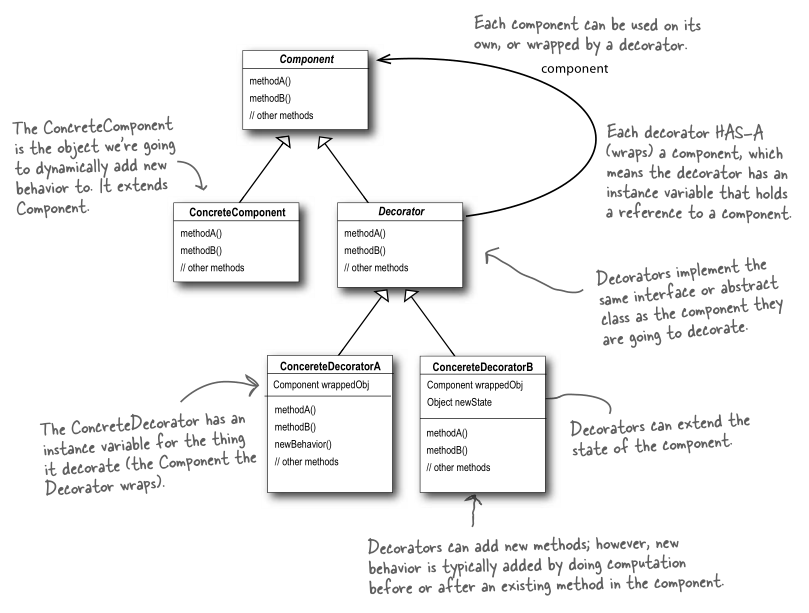

装饰者模式:动态地将责任附加到对象上,若要扩展功能,装饰者提供了比继承更有弹性的替代方案

装饰者模式具有的一些特征
1，装饰者（decorator）和被装饰（扩展）的对象有着相同的超类（supertype）。
2，我们可以用多个装饰者去装饰一个对象。
3，我们可以用装饰过的对象替换代码中的原对象，而不会出问题（因为他们有相同的超类）。
4，装饰者可以在委托（delegate，即调用被装饰的类的成员完成一些工作）被装饰者的行为完成之前或之后加上他自己的行为。
5，一个对象能在任何时候被装饰，甚至是运行时。

装饰者模式设计结构图:

参考博客
https://www.cnblogs.com/coffeeSS/p/5405787.html